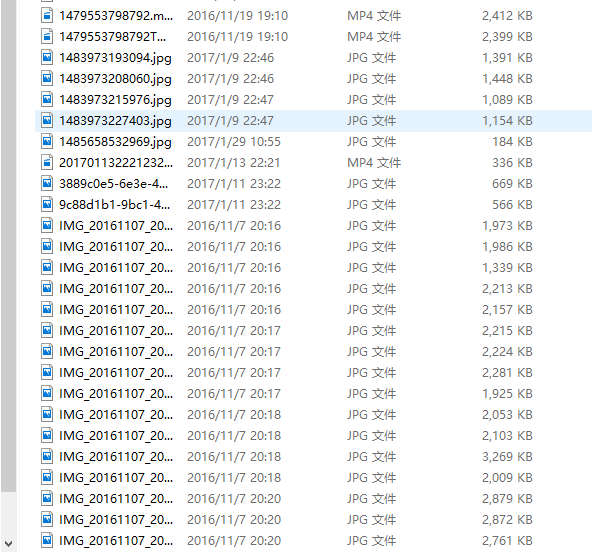

# sortfile

`把文件放在文件夹pht目录,分类运行`

### Install sortfile with npm

```
npm i sortfile
```


### Use sortfile

cmd
```
$ npm i sortfile
$ sf -i <file ...> -o <file ...>

```
or by node.js program
```
let  SF = require('sortfile');
let sf = new SF({root:'./pht'})
sf.init();
```



