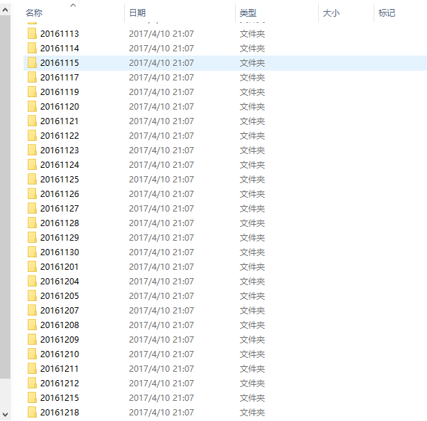

# sortfile

分类整理文件工具

`平时喜欢用手机拍照，但是不是经常导出整理。一般好几个月整理一次，我的整理方法是拍照时间区分文件。但是每次都要耗费大量时间，故此有了该项目。`

### Install sortfile with npm

```
npm i sortfile
```


### Use sortfile

cmd
```
$ npm i sortfile
$ sf -i <file ...> -o <file ...>

```
or by node.js program
```
let  SF = require('sortfile');
let sf = new SF({inSrc:'./pht'})
sf.init();
```


